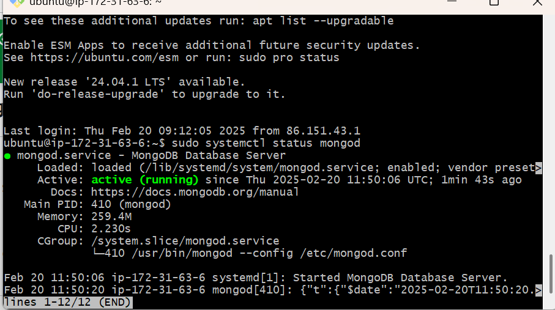
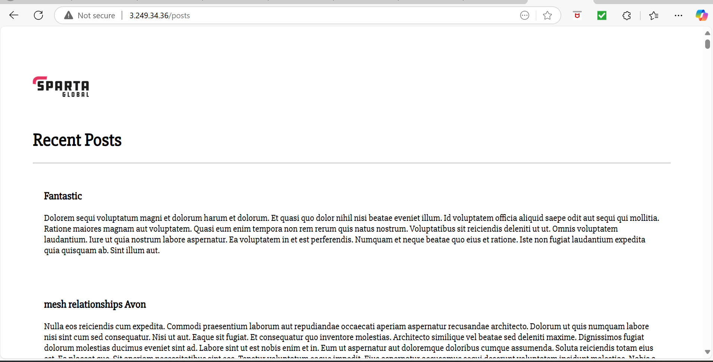

- [Deployment Guide: Two-Tier App on AWS](#deployment-guide-two-tier-app-on-aws)
  - [**1. Setting Up the Database VM (DB VM)**](#1-setting-up-the-database-vm-db-vm)
    - [**Step 1: Launch a New EC2 Instance**](#step-1-launch-a-new-ec2-instance)
    - [**Step 2: Connect to the DB VM \& Install MongoDB**](#step-2-connect-to-the-db-vm--install-mongodb)
  - [**2. Setting Up the Application VM (App VM)**](#2-setting-up-the-application-vm-app-vm)
    - [**Step 1: Launch the App VM**](#step-1-launch-the-app-vm)
    - [**Step 2: Verify the Application Works**](#step-2-verify-the-application-works)
  - [**3. Creating Custom Images for Faster Deployment**](#3-creating-custom-images-for-faster-deployment)
    - [**Step 1: Create an Image from DB VM**](#step-1-create-an-image-from-db-vm)
    - [**Step 2: Create an Image from App VM**](#step-2-create-an-image-from-app-vm)
  - [**4. Using Images to Deploy New Instances Faster**](#4-using-images-to-deploy-new-instances-faster)
  - [**5. Final Testing \& Cleanup**](#5-final-testing--cleanup)
  - [Blockers \& Solutions](#blockers--solutions)
  - [Key Learnings](#key-learnings)
  - [Benefits of Automation](#benefits-of-automation)

## 1. Overview

This project demonstrates the deployment of a **two-tier web application** on AWS using **EC2 instances for the App and Database layers**. The deployment is automated using **Bash scripting and User Data** to configure instances at launch.

- **Technology Stack**:
  - **Frontend & Backend:** Node.js (Express) + MongoDB
  - **Infrastructure:** AWS EC2 (App & DB VMs)
  - **Automation:** User Data Scripts for auto-provisioning

---

## 2. What is a Two-Tier Architecture?

A **two-tier architecture** consists of:
1. **Application Layer (App VM):** Serves frontend & backend logic.
2. **Database Layer (DB VM):** Stores and manages application data.

**How it works:**
- The **user** accesses the application via HTTP.
- The **App VM** processes requests and communicates with the **DB VM** over port **27017** (MongoDB).
- The **DB VM** stores and retrieves data, sending responses back to the App.


## 3. What Was Implemented?

### **Infrastructure Deployment**
- Created **EC2 instances** for App & Database in the same **VPC**  
- Used **Security Groups** to allow only necessary ports:
   - **App:** Port 80 (HTTP), 3000 (Node.js)
   - **DB:** Port 27017 (MongoDB) (Only accessible from App VM)  
Configured **Nginx Reverse Proxy** for better routing

### **Automation with User Data**
- Used **User Data scripts** for auto-provisioning:
   - **DB VM (`prov-db.sh`)**: Installs and configures MongoDB  
   - **App VM (`prov-app.sh`)**: Installs Node.js, clones the app, and starts the server  
Created **Custom AMIs** to launch instances faster  

---

## 4. Why Use User Data? (Benefits)

Using **User Data scripts** for instance provisioning provides several benefits:

### **Automation**
- No need for **manual SSH & configuration** after launching instances.
- The system is **ready to use** immediately.

### **Consistency**
- Ensures **every instance** is configured **exactly the same way**.
- Eliminates **human errors** from manual setup.

### **Faster Scaling**
- If the App VM fails, a new one can **launch automatically** with the same configuration.
- **AMIs** allow creating pre-configured VMs **instantly**.

## 5. Future Improvements

- Add **Auto Scaling & Load Balancer** for HA  
- Implement **Infrastructure as Code (Terraform)**  
- Secure DB using **private subnets & IAM roles**  

## Diagram below shows the overview of creating a two-tier deployment using Bash scripts:


# Deployment Guide: Two-Tier App on AWS

## **1. Setting Up the Database VM (DB VM)**

### **Step 1: Launch a New EC2 Instance**
1. Go to AWS **EC2 Dashboard** > **Instances** > **Launch Instance**.
2. **Select Amazon Machine Image (AMI):** Choose **Ubuntu 22.04**.
3. **Choose Instance Type:** t3.micro.
4. **Configure Security Group:**
   - Allow **port 27017 (MongoDB)** but restrict access to only the App VM.
5. **Add Storage:** Default 8GB.
6. **Advanced Details > User Data:** add the following :
```bash 
#!/bin/bash
set -e  # Stop script on error
export DEBIAN_FRONTEND=noninteractive  # Prevent user input prompts

# Update system
echo "Updating system packages..."
sudo apt-get update -y
echo "Installing required dependencies..."
sudo apt-get install -y gnupg curl

# Import MongoDB GPG Key (force overwrite)
echo "Importing MongoDB GPG Key..."
curl -fsSL https://www.mongodb.org/static/pgp/server-7.0.asc | \
   sudo gpg -o /usr/share/keyrings/mongodb-server-7.0.gpg --dearmor --yes

# Add MongoDB repository
echo "Adding MongoDB repository..."
echo "deb [ arch=amd64,arm64 signed-by=/usr/share/keyrings/mongodb-server-7.0.gpg ] https://repo.mongodb.org/apt/ubuntu jammy/mongodb-org/7.0 multiverse" | \
   sudo tee /etc/apt/sources.list.d/mongodb-org-7.0.list

# Update package lists
echo "Updating package lists..."
sudo apt-get update -y

# Install MongoDB 7.0.6 (without mongosh)
echo "Installing MongoDB 7.0.6..."
sudo apt-get install -y --allow-downgrades mongodb-org=7.0.6 mongodb-org-database=7.0.6 mongodb-org-server=7.0.6 mongodb-org-mongos=7.0.6 mongodb-org-tools=7.0.6 --no-install-recommends

# Prevent MongoDB from auto-upgrading
echo "Marking MongoDB packages to prevent auto-upgrading..."
sudo apt-mark hold mongodb-org mongodb-org-database mongodb-org-server mongodb-org-mongos mongodb-org-tools

# Configure MongoDB to accept external connections (bindIP 0.0.0.0)
echo "Configuring MongoDB to accept external connections..."
sudo sed -i 's/bindIp: 127.0.0.1/bindIp: 0.0.0.0/g' /etc/mongod.conf

# Reload systemd to recognize the MongoDB service
echo "Reloading systemd daemon..."
sudo systemctl daemon-reload

# Start MongoDB service
echo "Enabling MongoDB service..."
sudo systemctl enable mongod
echo "Starting MongoDB service..."
sudo systemctl start mongod
echo "Restarting MongoDB service..."
sudo systemctl restart mongod

echo "MongoDB installation and configuration completed."
```
7. **Launch the Instance**.


---

### **Step 2: Connect to the DB VM & Install MongoDB**

1. **SSH into the Instance:**
   ```bash
   ssh -i path/to/key ubuntu@<DB_VM_PUBLIC_IP>
   ```

2. **Verify MongoDB is Running:**
   ```bash
   sudo systemctl status mongod
   ```


---

## **2. Setting Up the Application VM (App VM)**

### **Step 1: Launch the App VM**
1. Go to AWS **EC2 Dashboard** > **Launch Instance**.
2. **Select Ubuntu 22.04** as the base AMI.
3. **Choose Instance Type:** t3.micro.
4. **Configure Security Group:**
   - Allow **port 80 (HTTP)** and **port 3000 (Node.js App)**.
5. **Add Storage:** Default 8GB.
6. **Advanced Details > User Data:** Paste the following script:
```bash
#!/bin/bash

echo "Updating and upgrading system packages..."
sudo apt update -y && sudo apt upgrade -y
echo "Installing required dependencies..."
sudo apt install -y gnupg curl nginx

# Install Node.js and PM2
echo "Installing Node.js and PM2..."
curl -fsSL https://deb.nodesource.com/setup_20.x | sudo -E bash -
sudo apt install -y nodejs
echo "Installing PM2..."
sudo npm install -g pm2

# Clone the Application
echo "Cloning the application repository..."
git clone https://github.com/marmari9/tech501-sparta-app.git /home/ubuntu/sparta-app
echo "Changing directory to application folder..."
cd /home/ubuntu/sparta-app
echo "Installing application dependencies..."
npm install

# Set Environment Variable for DB Connection
echo "Setting environment variable for database connection..."
echo "export DB_HOST=mongodb://<DB_VM_PRIVATE_IP>:27017/sparta" | sudo tee -a /etc/environment
source /etc/environment

# Start Application
echo "Starting the application with PM2..."
pm2 start app.js --name sparta-app
echo "Saving PM2 process list..."
pm2 save
echo "Setting up PM2 to run on system startup..."
pm2 startup systemd

# Configure Nginx Reverse Proxy
echo "Configuring Nginx reverse proxy..."
sudo bash -c 'cat > /etc/nginx/sites-available/default <<EOF
server {
    listen 80;
    location / {
        proxy_pass http://localhost:3000;
    }
}
EOF'

echo "Restarting Nginx service..."
sudo systemctl restart nginx
echo "Setup completed successfully."
```
7. **Launch the Instance**.


### **Step 2: Verify the Application Works**
1. **SSH into the App VM:**
   ```bash
   ssh -i path/to/key ubuntu@<APP_VM_PUBLIC_IP>
   ```
2. **Check if the app is running:**
   ```bash
   pm2 list
   ```
3. **Test the application:**
   ```bash
   curl http://localhost:3000/posts
   ```
4. **Visit the App in Browser:** Open `http://<APP_VM_PUBLIC_IP>`

- On port 3000:


- with reverse proxy:


- The posts page:



## **3. Creating Custom Images for Faster Deployment**

### **Step 1: Create an Image from DB VM**
1. Go to **AWS EC2 Dashboard**.
2. Select the **Database Instance**.
3. Click **Actions > Image & Templates > Create Image**.
4. Click **Create Image**.

- Image created from the instances with user data:


### **Step 2: Create an Image from App VM**
1. Select the **Application Instance**.
2. Click **Actions > Image & Templates > Create Image**.
3. Click **Create Image**.


---

## **4. Using Images to Deploy New Instances Faster**
1. **Launch New DB VM** using the **MongoDB-Preconfigured** image.
2. **Launch New App VM** using the **App-Preconfigured** image.
3. Add minimal **User Data** to start the app:
   ```bash
   #!/bin/bash
   export DB_HOST=mongodb://<DB_VM_PRIVATE_IP>:27017/sparta
   cd /home/ubuntu/sparta-app
   pm2 start app.js
   ```
- Launch the database instance from image:


---

## **5. Final Testing & Cleanup**
- Verify that the App can connect to the Database and fetch posts.
- Clean up old instances to save costs.

- posts page is running without the need to ssh to instance:


## Blockers & Solutions
| Issue | Reason | Solution |
|--------|--------|------------|
| MongoDB connection refused | Security groups blocking port 27017 | Open port 27017 for the App VM in the Security Group |
| User data script failed | Permissions issues | Used `chmod +x` before execution |
| Reverse proxy not routing requests | Incorrect Nginx config | Updated `proxy_pass http://localhost:3000;` and restarted Nginx |

## Key Learnings
- How to automate deployment with **user data scripts**.
- How to create and use **custom AMIs** for faster provisioning.
- Importance of **security group configurations**.
- Troubleshooting **MongoDB connectivity issues** in a multi-tier app.

## Benefits of Automation
- **Faster deployments** using AMIs instead of manual setup.
- **Reduced human errors** by automating configurations.
- **Scalability** with the ability to spin up multiple app instances.
